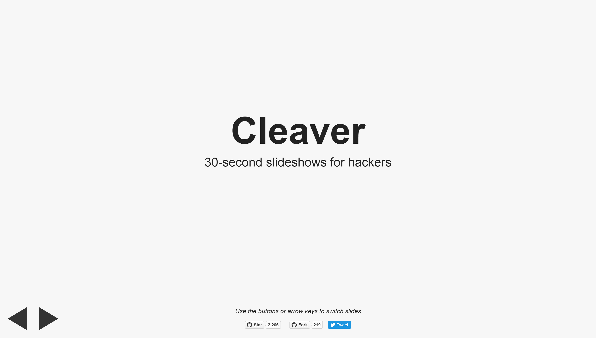

# htmlでプレゼン資料作り！！
# ～パワポよりも自由で簡潔に～

---
## 自己紹介
- 名前：深野大我
- 出身：埼玉県熊谷市
- 年齢：24
- 職種：コーダー
- 趣味：サバゲー、ドライブ、動画編集

---
## プレゼン資料作成ライブラリについて

---
### パワポじゃだめなの？

 * htmlで作るのでブラウザで見れる！
 * 公開&共有しやすい！
 * markdownを用いるので、htmlの実装も簡単！
 * cssやjsでデザインや動きの調整も可能！

---
## どんな種類のライブラリがあるの？
---
### Remark
 https://github.com/gnab/remark

 

>>>
### 特徴

#### 長所
 * Githubでソースが公開されている
 * htmlベースで資料が作れる
 * サーバを立てずにローカルでスライドを表示できる
 * 後述のReveal.jsよりも簡単で、シンプルな資料作りに向いている

#### 短所
 * 横方向にしか作れない
 * スタイルはcssを使い初めから自力で調整する必要がある

---
### Reveal.js
https://github.com/hakimel/reveal.js/

 

>>>
### 特徴

#### 長所
 * chromeでPDF化できる
 * 縦方向のスライドを作ることができる
 * 他よりも拡張性が広い
 * 豊富なスタイルがあらかじめ用意されている

#### 短所
 * markdownで簡略化できるとはいえ、htmlマークアップ量が他より多くなるので、調整の手間が多い
 * 図や表、アニメーションを使うにはあまり向いていない

---
### Cleaver
https://github.com/jdan/cleaver

 

>>>
### 特徴

#### 長所
 * コマンド1行でインストール可能
 * themeでデザインテンプレートを選べる

#### 短所
 * node.jsをインストールしていないとそもそもインストールできない
 * ある程度仕様に合わせないといけない部分もある

---
## このプレゼンで使用したライブラリは

### Reveal.js
- - -
#### -なぜなら-
 * 縦方向にスライドを作ることが出来るので、段落ごとにまとめやすい
 * 3次元的な動きなので、「プレゼンで見せること」に一番適していると判断

---
## 余談
---
### Swipe
 
>>>
### 特徴

#### 長所
 * テンプレートやフォントがあらかじめ用意されている
 * レスポンシブデザインに対応
 * パワポのようにドラッグ&ドロップでスライドを簡単にインポートできる
 * 工数が手軽

#### 短所
 * 用意してあるフォントの種類が少ない
 * 独自にcssを指定できない為、ライブラリのように細かい調整ができない

---
##ご清聴、ありがとうございました！